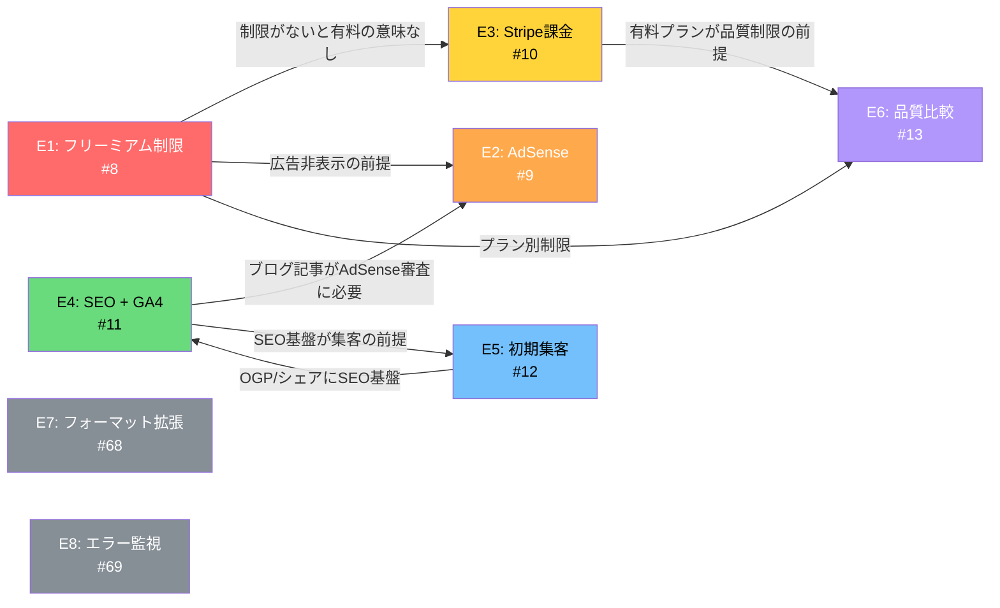
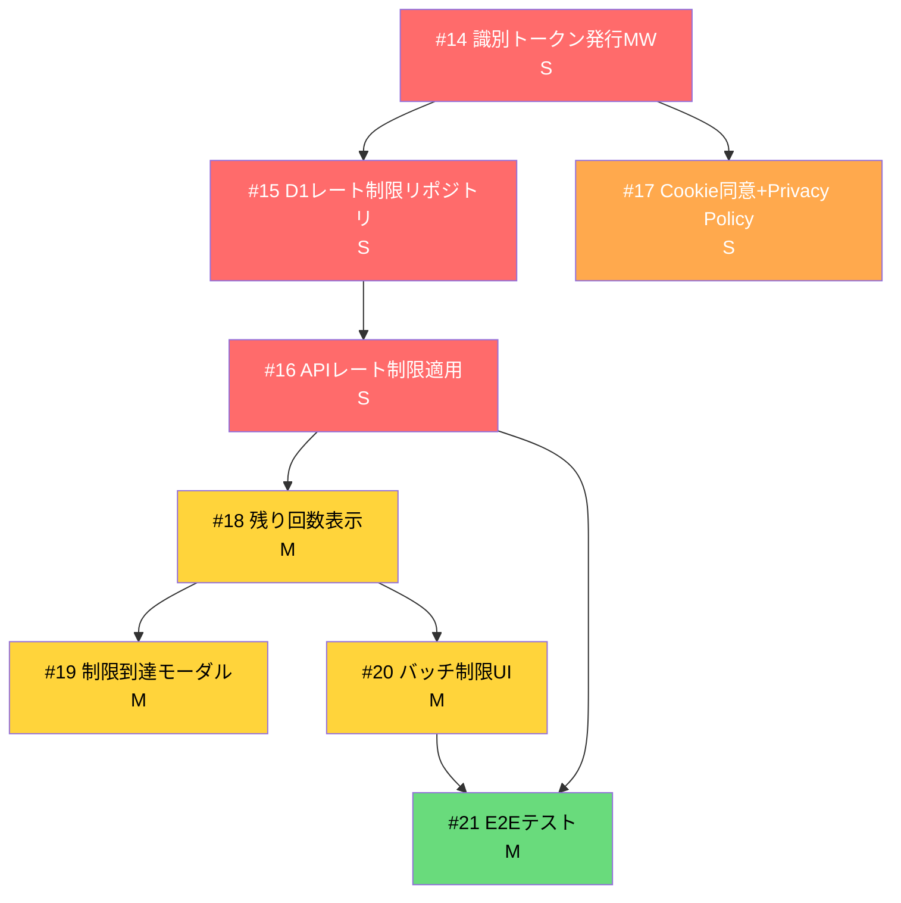
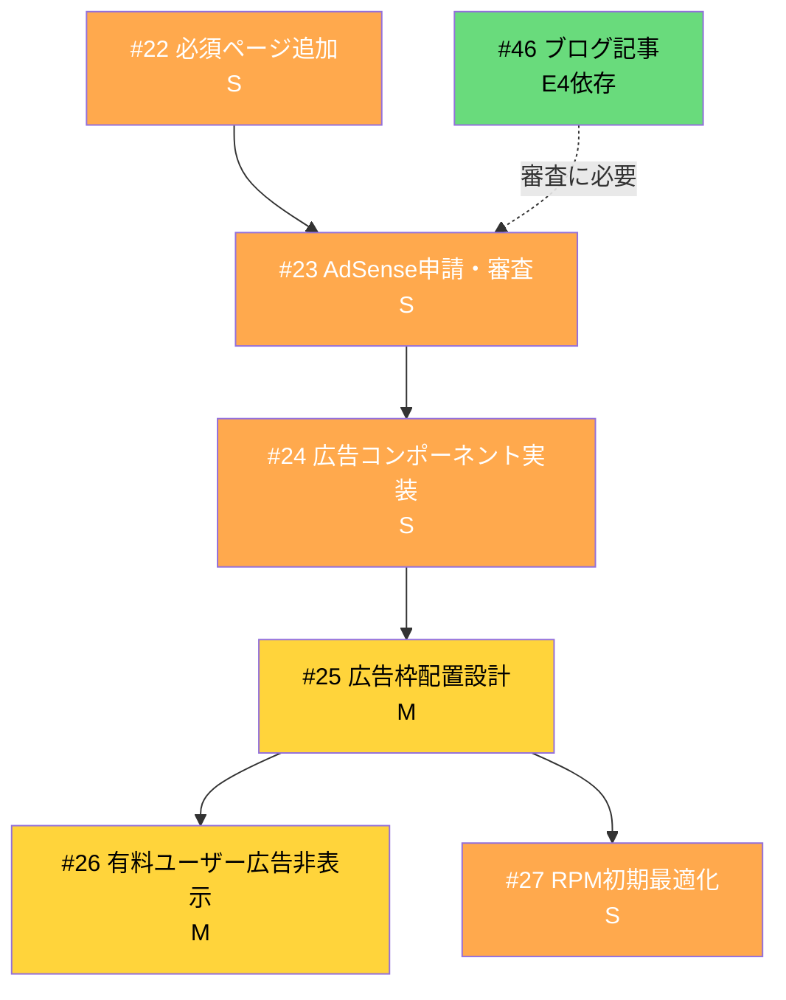
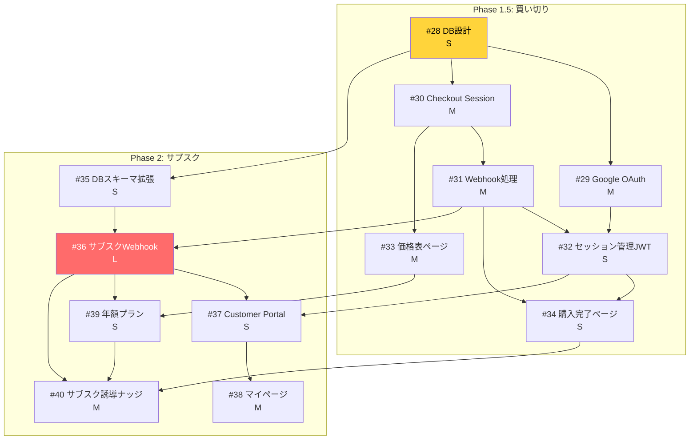
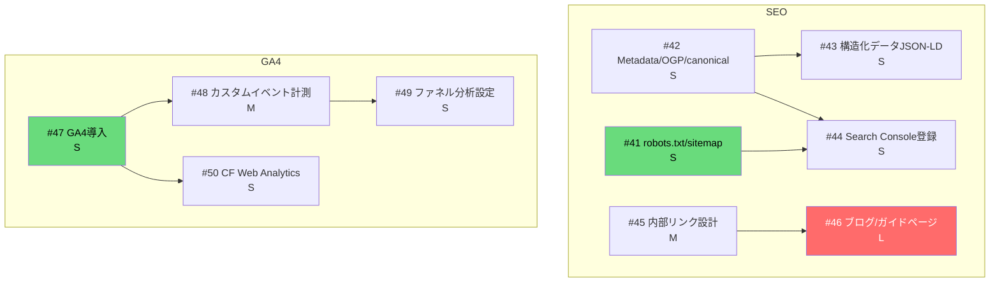
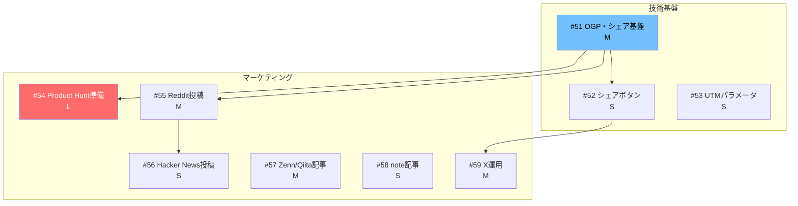
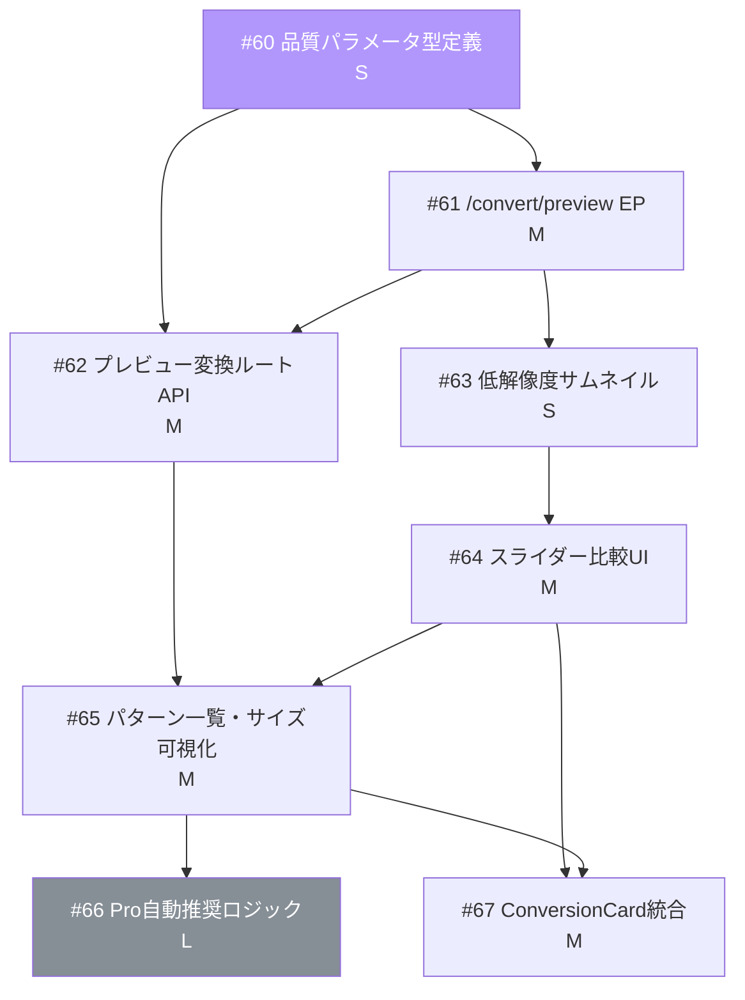
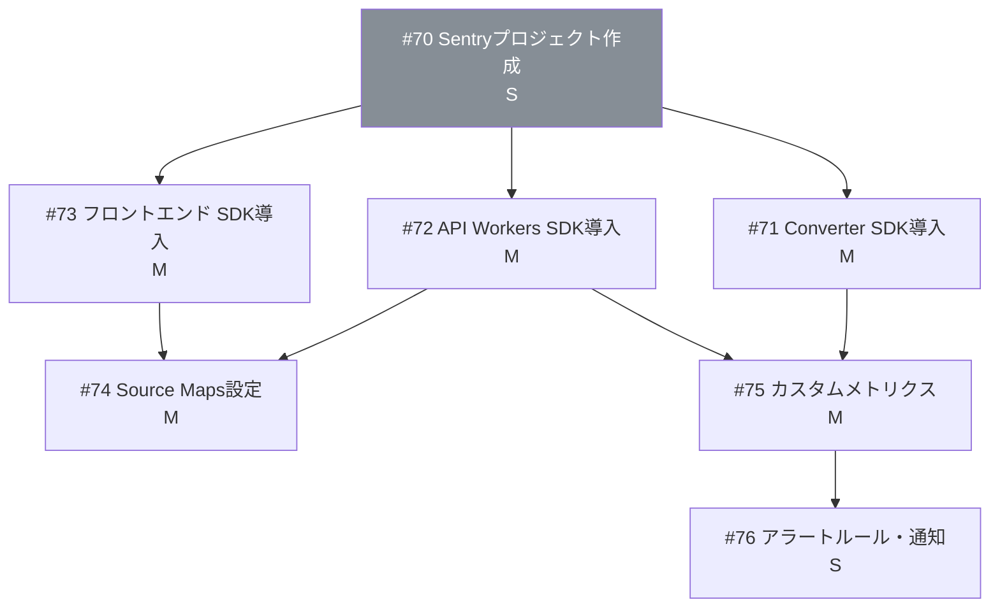

# QuickConv 依存関係マップ

## エピック間の依存関係

## E1: フリーミアム制限 サブIssue依存関係

## E2: AdSense サブIssue依存関係

## E3: Stripe課金 サブIssue依存関係

## E4: SEO + GA4 サブIssue依存関係

## E5: 初期集客 サブIssue依存関係

## E6: 品質比較プレビュー サブIssue依存関係

## E8: エラー監視 サブIssue依存関係

