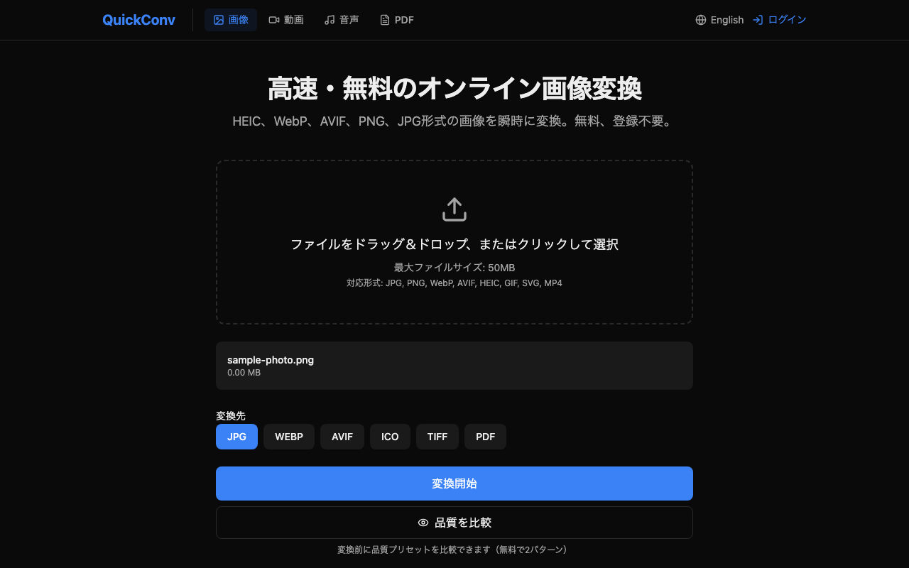

# I Built an Image Conversion SaaS on (Almost) $0/Month — Here's the Full Stack


A few months ago I got frustrated trying to convert a HEIC photo on my iPhone into something my client could actually open. The tools I found were either slow, ugly, or locked behind a paywall after one use. So I built [QuickConv](https://quickconv.cc) — a file conversion service focused on next-generation image formats like WebP, AVIF, and HEIC.

This post is a full technical breakdown: what I chose, why I chose it, and what I'd do differently. No marketing fluff.

---

## Architecture Overview

Here's the bird's-eye view:

```
Browser (Next.js static)
        │  HTTPS
        ▼
Cloudflare Pages  (CDN edge, static HTML/JS)
        │
        │  API calls
        ▼
Cloudflare Workers  (Hono — api.quickconv.cc)
        │               │
        │ R2 presign     │ convert job dispatch
        ▼               ▼
Cloudflare R2     GCP Cloud Run  (Sharp / FFmpeg / Ghostscript)
(file storage)          │
        ▲               │ callback on completion
        └───────────────┘
              │
              ▼
        Cloudflare D1
        (job state, rate limits, users)
```

The key design decision: **split sharp-based conversion into a separate container** rather than running it inside Workers. That single choice drove most of the rest of the architecture.

---

## Frontend: Next.js with Static Export

The frontend is a Next.js 15 App Router app. The entire build is configured as a static export:

```ts
// apps/web/next.config.ts
const nextConfig: NextConfig = {
  output: "export",
  productionBrowserSourceMaps: true,
};
```

`output: "export"` means `next build` produces a directory of static HTML, JS, and CSS — no Node.js server required. That output gets deployed directly to Cloudflare Pages.

**Why static export?**

- Cloudflare Pages serves static assets from its global CDN at no compute cost
- No cold starts, no server to manage
- Pages has a generous free tier (unlimited requests for static assets)

The tradeoff: no server-side rendering per request. For a conversion tool this is fine — the page content doesn't change per user. Dynamic data (job status, user account) is fetched client-side from the API.

**Internationalization** is handled by `next-intl` with `ja` and `en` locale support baked into the static export. The locale is resolved from the URL path (`/en/`, `/ja/`).

---

## API Layer: Hono on Cloudflare Workers

The API is a [Hono](https://hono.dev/) application deployed to Cloudflare Workers at `api.quickconv.cc`.

```
/api/upload    — receive file, store in R2
/api/convert   — create job, dispatch to converter
/api/status    — poll job state from D1
/api/download  — stream converted file from R2
/api/auth      — Google OAuth (JWT cookie)
/api/checkout  — Stripe checkout session
/api/webhook   — Stripe webhook handler
/api/account   — subscription info
/v1/convert    — public API for developers (API key auth)
```

**Why Hono instead of Express or Fastify?**

Three reasons:

1. **Workers compatibility.** Express and Fastify are built around Node.js APIs (`http.IncomingMessage`, `Buffer`, etc.) that don't exist in the Workers runtime. Hono is built on the Web Standard APIs (`Request`, `Response`, `Headers`) that Workers natively support. No polyfills, no shims.

2. **TypeScript ergonomics.** Hono has excellent type inference for route handlers, middleware, and context variables. The `Bindings` and `Variables` generics let me type-check R2 bindings, D1 bindings, and middleware-set values at compile time.

3. **Size.** Workers have a 1MB (compressed) script size limit. Hono is tiny.

The middleware stack in order: Sentry → CORS → identification → optional auth → cost guard → rate limit.

The identification middleware generates a stable `clientHash` from IP + User-Agent (hashed, no PII stored) to track anonymous usage for rate limiting without requiring login.

---

## Conversion Engine: Sharp on GCP Cloud Run

This is where things get interesting.

**Why not run Sharp in Workers?**

Workers run in V8 isolates — a JavaScript-only sandbox. Sharp is a native Node.js addon built on `libvips`. Native binaries cannot run in V8 isolates. You can run WebAssembly in Workers, and there is a `sharp` WASM build, but as of writing it doesn't support AVIF encoding and is significantly slower for large images.

For a service where the core value proposition is "convert HEIC/AVIF fast," that's a non-starter.

The solution: a separate container on Cloud Run.

The converter is itself a small Hono app (`@hono/node-server`) that runs on Node.js 22 with native Sharp:

```dockerfile
FROM node:22-slim AS builder
# ... build stage ...

FROM node:22-slim
RUN apt-get update && apt-get install -y \
    libvips-dev \
    ffmpeg \
    ghostscript
# ...
```

Note `ffmpeg` and `ghostscript` are also installed — this handles video conversions and PDF operations respectively.

**The conversion flow:**

1. Worker receives `/api/convert` request
2. For images/audio: Worker fetches the file from R2, POSTs it to Cloud Run (`/convert/direct`), streams back the result
3. For videos (which can take minutes): Worker dispatches an async job via `c.executionCtx.waitUntil()`, Cloud Run pulls the file from R2 directly, converts, writes back to R2, then POSTs a callback to the Worker to update the D1 job record

Workers have a 30-second CPU time limit. `waitUntil()` extends this for background work, but video conversions can still exceed it. The async R2-based flow for video sidesteps this entirely.

**Image quality defaults (from the actual code):**

```ts
const DEFAULT_QUALITY: Record<string, number> = {
  jpg: 85,   // mozjpeg
  webp: 80,
  avif: 65,  // AVIF compresses aggressively; 65 looks good
  tiff: 80,
};
```

AVIF at quality 65 typically produces files 50–70% smaller than JPEG at equivalent perceptual quality. That compression ratio is why I focused on next-gen formats.

**Cloud Run configuration:** `max-instances=1`. This is intentional cost control during early stages. A single instance handles queue sequentially. As traffic grows this will increase, but starting at 1 means zero idle cost outside the free tier.

---

## Storage: Cloudflare R2

All files — uploaded originals and converted outputs — live in R2 (`quickconv-files` bucket).

**Why R2 over S3?**

One reason: **zero egress fees**. S3 charges ~$0.09/GB for data transferred out. For a conversion service, every download is egress. R2 charges $0 for egress to the internet.

The math:
- 1,000 conversions/day × avg 2MB output = 2GB/day egress
- S3: ~$5.40/month just for egress
- R2: $0

Storage cost is $0.015/GB/month after the 10GB free tier. At current scale, I'm in the free tier.

**24-hour auto-delete:** Files are automatically expired after 24 hours. This is configured as an R2 lifecycle rule, not application-level deletion. It runs even if the API is down.

The `FILE_EXPIRY_HOURS = 24` constant in the shared package is purely for setting the `expiresAt` field in D1 (for display purposes). The actual deletion is infrastructure-level.

---

## Database: Cloudflare D1

D1 is Cloudflare's serverless SQLite. I use it for:

- Job records (status, input/output R2 keys, timestamps)
- Rate limit counters (daily conversions per `clientHash`)
- User accounts (email, Stripe customer ID, plan)
- Video conversion monthly counters

**Why D1 and not Postgres/PlanetScale/Turso?**

For a Workers-native app, D1 is the obvious choice: zero latency to bind, no connection pooling issues (SQLite has no connection limit), and it's free for the first 5M rows/month.

The schema is managed with Wrangler migrations:

```bash
npx wrangler d1 migrations apply quickconv-db --remote
```

SQLite's single-writer model is fine for this workload. Rate limit increments use `INSERT OR REPLACE` patterns that are safe under SQLite's serialized writes.

---

## Payments: Stripe

Stripe handles all billing. The checkout flow: Workers creates a Stripe Checkout Session, redirects the user, Stripe POSTs to `/api/webhook` on completion, Worker updates the D1 user record with the plan.

---

## Developer API

One thing I added recently that I'm excited about: a public `/v1/convert` endpoint for developers.

```bash
curl -X POST https://api.quickconv.cc/v1/convert \
  -H "Authorization: Bearer qc_YOUR_API_KEY" \
  -F "file=@photo.jpg" \
  -F "output_format=webp"
```

Developers get an API key from their account dashboard. The key is authenticated via middleware, rate-limited per plan, and the conversion hits the same Cloud Run backend. No separate infrastructure — the same Sharp container serves both the UI and the API.

This was about 2 days of work on top of the existing backend. The hard part (conversion, storage, rate limiting) was already done.

---

## Monitoring: Sentry

Sentry is initialized in all three components:

- **Frontend** (`@sentry/nextjs`) — captures unhandled errors and route transitions
- **API Workers** (`@sentry/cloudflare`) — captures Worker exceptions with breadcrumbs per conversion
- **Converter** (`@sentry/node`) — captures conversion failures with file size/format context

The converter adds structured breadcrumbs for every conversion:

```ts
addConversionBreadcrumb({
  conversionFormat: `${inputFormat}-to-${outputFormat}`,
  durationMs: Date.now() - startTime,
  fileSizeInput: inputBuffer.length,
  fileSizeOutput: result.size,
});
```

This makes it easy to diagnose which format pairs are slow or failing.

---

## Cost Breakdown

Monthly costs at current (early) scale:

| Service | Cost |
|---------|------|
| Cloudflare Workers | $0 (free tier: 100K req/day) |
| Cloudflare Pages | $0 (static assets, unlimited) |
| Cloudflare R2 | $0 (under 10GB free tier) |
| Cloudflare D1 | $0 (under 5M rows free tier) |
| GCP Cloud Run | $0 (under ~180K vCPU-seconds free/month) |
| Domain (quickconv.cc) | ~$1/month amortized |
| Sentry | $0 (free tier: 5K errors/month) |
| **Total** | **~$1/month** |

The GCP free tier for Cloud Run is 180,000 vCPU-seconds per month. A typical image conversion takes ~0.5–2 seconds of CPU. That's roughly 90,000–360,000 conversions before I pay anything on Cloud Run.

When I exceed free tiers, the marginal cost is still low: Workers Paid plan is $5/month for 10M requests. R2 storage is $0.015/GB. Cloud Run is ~$0.024 per vCPU-hour.

---

## Lessons Learned

**1. Don't fight the platform.** When I first designed the converter, I tried to shoehorn Sharp into a Worker via WASM. It took two days to discover AVIF encoding wasn't supported. Accepting that Workers can't run native binaries and reaching for Cloud Run took an afternoon. Know your runtime's constraints upfront.

**2. Shared types are worth the monorepo overhead.** The `@quickconv/shared` package contains types, format constants, and validation schemas used by both the API Worker and the converter container. Without it, I'd have duplicated ~500 lines and diverged them within a week.

**3. Static export is underrated.** The combination of Next.js static export + Cloudflare Pages is genuinely fast — Time to First Byte from edge nodes is under 50ms globally. For content that doesn't change per request, there's no reason to pay for server-side rendering.

**4. R2 egress pricing changes the math entirely.** If you're building anything where users download files, compare R2 vs S3 egress costs before assuming S3 is the default. For download-heavy workloads, R2 is often 5–10x cheaper.

**5. `waitUntil()` is not a queue.** Workers' `executionCtx.waitUntil()` lets you run background work after returning a response, but it still has limits (30-second CPU, subject to Workers runtime constraints). For video conversions that might run 5+ minutes, I moved to a true callback pattern: dispatch to Cloud Run, Cloud Run calls back when done.

---

## What's Next

- Format expansion: SVG → PNG, PDF → image batch
- Quality comparison preview (side-by-side before/after slider)
- More language support beyond ja/en

---

## Try It



[quickconv.cc](https://quickconv.cc) — free tier is 10 conversions/day, no account required.

If you're building something that needs image conversion, the [developer API](https://quickconv.cc/en/developers) is live. Free tier includes 100 conversions/month.

The stack is deliberately unsexy: Next.js, Hono, Sharp, SQLite. No Kubernetes, no microservices, no Kafka. It serves the use case, runs on almost nothing, and I can reason about the whole thing in my head. That feels like the right place to start.

---

*Built with Next.js 15, Hono 4, Sharp 0.33, Cloudflare Workers/Pages/R2/D1, GCP Cloud Run, Stripe, Sentry.*

---

## How QuickConv Compares to Existing Converter SaaS

| Aspect | QuickConv | Convertio | iLoveIMG | TinyPNG |
|---|---|---|---|---|
| Free tier | 10 conversions/day | 10/day, 100MB cap | 15/hour | 20 images/month |
| Account required | No | No (paid tier requires) | No | No (paid tier requires) |
| API access | Yes (`api.quickconv.cc`) | Yes (paid) | Yes (paid) | Yes (free up to 500/month) |
| Auto-delete window | 24 hours (hard) | Varies | 2 hours | Not documented |
| WebP / AVIF / HEIC | All three, any-to-any | Yes (broad format coverage) | WebP only | PNG / JPEG / WebP |
| Stack visibility | Open architecture (this post) | Closed | Closed | Closed |

QuickConv is intentionally narrow: next-gen image formats first, indie-built, with the whole stack documented. The big converters are broader but opaque — when you hit an edge case, there's no source of truth.

---

## About the Author

QuickConv is built and maintained by an indie developer (X: [@quickconv](https://twitter.com/quickconv)) who ships image and video conversion features end-to-end — frontend, API, converter pipeline, billing, and SEO. All benchmarks and screenshots in this post come from production runs on the [quickconv.cc](https://quickconv.cc) stack described above.
