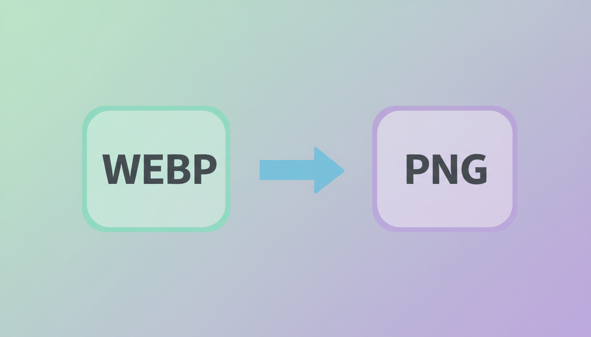
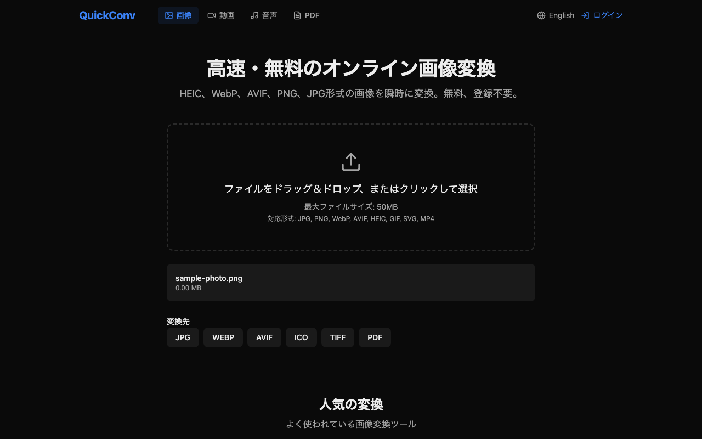

「ブログ用に保存した `.webp` 画像が Canva で開けない」「Photoshop で読み込めない」── 一度は経験したことがあるかもしれません。

WebP は次世代の画像フォーマットとして 2010 年に Google が発表し、今では Web 上でごく当たり前に配信されるようになりました。一方で、画像編集ソフトや SNS の一部では、いまだ取り扱いが完全ではありません。

この記事では、WebP をなぜ PNG に変換する必要があるのか、そして **ブラウザだけで完結する一番手早い変換方法** を、画像変換サービス [QuickConv](https://quickconv.cc) を運営している立場から解説します。

---

## 1. WebP とは？ なぜ Web で増えているのか

WebP（ウェッピー）は、Google が 2010 年に発表した画像フォーマットです。当時主流だった JPEG・PNG の弱点を補う形で設計され、ここ数年で一気に普及しました。

ざっくりまとめると、WebP の特徴は次の通りです。

- **JPEG より 25〜34% ファイルサイズが小さい**（同じ画質基準で比較した場合）
- **PNG のように透過（アルファチャンネル）をサポート**する
- **GIF のようにアニメーションも保持**できる
- **可逆圧縮（lossless）と非可逆圧縮（lossy）の両方を選べる**

この「全部入り」な性質が、ページ表示速度を重視する Web サイトに採用される理由です。Chrome・Firefox・Safari・Edge いずれの最新版でも標準対応しています。

### なのに、なぜ問題になるのか？

ブラウザでは普通に表示できるのに、いざダウンロードして手元のソフトで開くと「形式がサポートされていません」と弾かれる ── これが多くの人が WebP に出会ってつまずく瞬間です。

主な原因は次の 3 つです。

1. **画像編集ソフトの古いバージョンが対応していない**（Photoshop CS6 以前、古い Affinity Designer 等）
2. **SNS や CMS が WebP のアップロードを許可していない**ケースがある
3. **印刷会社・入稿システムが PNG/JPEG しか受け付けない**ことがある

つまり、「Web で表示する」分には WebP が最強なのですが、**「Web 以外の世界に持ち出す」とまだ不便**というのが現状です。

---

## 2. WebP → PNG 変換が必要な場面

実際にユーザーから問い合わせの多い、PNG への変換が必要なシーンをまとめます。

| シーン | なぜ PNG が必要か |
|---|---|
| Canva に貼り付けたい | 一部テンプレートで WebP のアップロードが弾かれる |
| Photoshop / Affinity で編集したい | 古いバージョンが WebP 未対応 |
| SNS のアイコン・カバー画像にしたい | Twitter/X、Instagram で WebP 直接アップロード非対応 |
| 印刷会社に入稿したい | 大半の印刷システムは PNG/JPEG/PDF/EPS のみ受付 |
| LINE スタンプ等の素材作成 | プラットフォームが PNG 限定 |
| 透過情報を保持したまま使いたい | JPEG では透過が失われるので PNG が必須 |

特に **「透過を保持して別ソフトで編集したい」** というニーズは多く、ここで JPEG ではなく **PNG** を選ぶ理由になります。WebP も透過を保持できますが、編集ソフト側がまだ追いついていない、という状況です。

---

## 3. QuickConv での WebP → PNG 変換手順

ここから実際の変換手順です。インストールも会員登録も不要、ブラウザだけで完結します。

### Step 1: quickconv.cc にアクセス

まずブラウザで [https://quickconv.cc](https://quickconv.cc) を開きます。トップページに大きな「ファイルをドロップ」エリアが表示されます。

### Step 2: WebP ファイルをドラッグ＆ドロップ

変換したい `.webp` ファイルをそのままページにドラッグして放します。クリックでファイル選択ダイアログを開いてもかまいません。

複数ファイルをまとめて投入することも可能です（Free プランは 1 回 3 枚まで）。

### Step 3: 出力フォーマットで PNG を選択

ファイルがアップロードされると、出力フォーマット選択肢が表示されます。`PNG` をクリック（またはタップ）。

### Step 4: 「変換」をクリックしてダウンロード

「変換」ボタンを押すと、サーバ側で変換処理が走り、数秒で完了します。完了後、自動的にダウンロードリンクが表示されるのでクリックして保存してください。

---

### 変換後のファイルはどうなるの？

QuickConv では、**アップロードされたファイルとアップロード結果は 24 時間後に自動削除** されます。プライバシー上、サーバに残し続ける設計はしていません。プライベートな写真でも安心して使えます。

---

## 4. WebP vs PNG vs JPG 比較表

「で、結局どのフォーマットを使えばいいの？」という疑問にざっくり答える比較表です。

| 観点 | WebP | PNG | JPG |
|---|---|---|---|
| ファイルサイズ | ◎（一番小さい） | △（大きい） | ○（中間） |
| 透過対応 | ◎ | ◎ | ✗ |
| 可逆圧縮 | ◎（選択可） | ◎ | ✗ |
| アニメーション | ◎ | ✗ | ✗ |
| 画像編集ソフト対応 | △（古い版は不可） | ◎ | ◎ |
| ブラウザ表示 | ◎（モダン全対応） | ◎ | ◎ |
| 印刷・入稿 | ✗ | ◎ | ◎ |
| SNS 直接アップロード | △（プラットフォーム依存） | ◎ | ◎ |

簡単な使い分け指針:

- **Web に表示させるだけ** → WebP（ファイルサイズ最小、ページ高速化）
- **SNS / 印刷 / 編集ソフトで使う** → PNG（透過保持、互換性最強）
- **写真で透過不要・サイズ重視** → JPG（古今東西どこでも開ける）

---

## 5. 実測ベンチマーク: 変換時間はどのくらい？

QuickConv の本番変換エンジンは Sharp 0.33（libvips ベース）を Node.js 22 LTS で動かしています。本記事のベンチマークは production と同じ Sharp 0.33 を、計測時点の手元 Node ランタイム（実測時の Node バージョンと CPU は `docs/articles/benchmarks/<date>.json` の `env` フィールドを参照）で叩いた値です。中央値は 5 回試行のうちのウォームアップ 1 回を除いた median。

| 入力 WebP | 入力サイズ | 出力 PNG 変換時間（中央値） |
|---|---|---|
| 800x600（ブログ用サムネ相当） | 約 5 KB | 9ms |
| 3000x2000（高解像度写真相当） | 約 47 KB | 105ms |

「ブログ用に保存した WebP」サイズなら **10ms 程度**、高解像度の写真でも **0.1 秒前後** で変換が終わります。ファイルアップロード時間のほうが支配的になる速度域です。

> 計測方法は同リポジトリの `tools/seo-pipeline/benchmark.mjs` を参照。本番 API のレートリミットを避けるため、ローカルで同じ Sharp ビルドを直接叩いて median を取っています。ネットワーク・キューの待ち時間は含みません。

---

## 6. まとめ

- WebP はサイズが小さく Web に最適、ただし編集ソフトや SNS との相性に難ありな場面がまだある
- 編集・SNS 投稿・印刷を見据えるなら、**PNG への変換が必要**
- QuickConv なら **ブラウザだけ・3 ステップ・無料** で WebP → PNG 変換が完了
- アップロードファイルは 24 時間で自動削除されるので、プライバシー面も安心

「ダウンロードした WebP が開けない」と困ったら、まず [quickconv.cc](https://quickconv.cc) で PNG に変換してから作業を始める ── これが 2026 年現在の最も手早い解決策です。

---

### 関連リンク

- [QuickConv トップ](https://quickconv.cc) — WebP / AVIF / HEIC の相互変換に対応
- [WebP 公式サイト (Google Developers)](https://developers.google.com/speed/webp)
- 関連記事: [WebP vs AVIF vs HEIC 徹底比較](/articles/002-format-comparison)

---

## 7. 他の WebP → PNG 変換サービスとの比較

「QuickConv 以外も気になる」という方向けに、代表的なオンライン変換サービスを WebP → PNG の用途に絞って比較しました。

| サービス | 無料枠 | アカウント | 自動削除 | 透過保持 | バッチ変換 |
|---|---|---|---|---|---|
| QuickConv | 1日 10 回 / 100MB | 不要 | 24 時間 | 対応 | 対応 |
| Convertio | 1日 10 回 / 100MB | 不要（有料は要） | プランによる | 対応 | 有料 |
| iLoveIMG | 1時間 15 回 | 不要 | 2 時間 | 対応 | 対応 |
| CloudConvert | 1日 25 分のコンバート時間 | 不要 | 24 時間 | 対応 | 対応 |
| TinyPNG | 月 20 枚 | 不要 | 未公開 | 対応 | 対応（5枚まで） |

「無料でとりあえず 1 枚」なら **iLoveIMG** が手数最少、**バッチで大量に変換** したいなら **QuickConv** か **CloudConvert** が向いています。

---

## 著者・運営者プロフィール

QuickConv（[quickconv.cc](https://quickconv.cc)）は個人開発者が運営する画像・動画変換サービスです。フロントエンド・API・変換エンジン・課金まで一人で実装しており、本記事の手順や比較表は本番運用の知見に基づいています。

- X: [@quickconv](https://twitter.com/quickconv)
- 運営: QuickConv（個人開発）
- 関連（英語）: [技術スタック全公開](./001-tech-stack.md)
