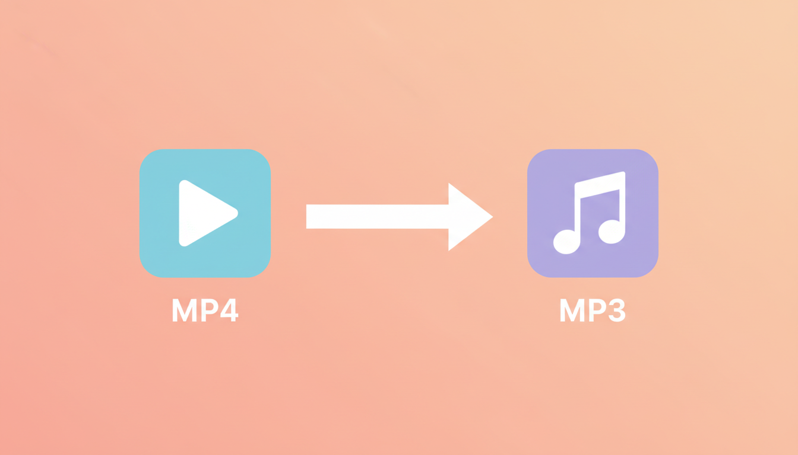
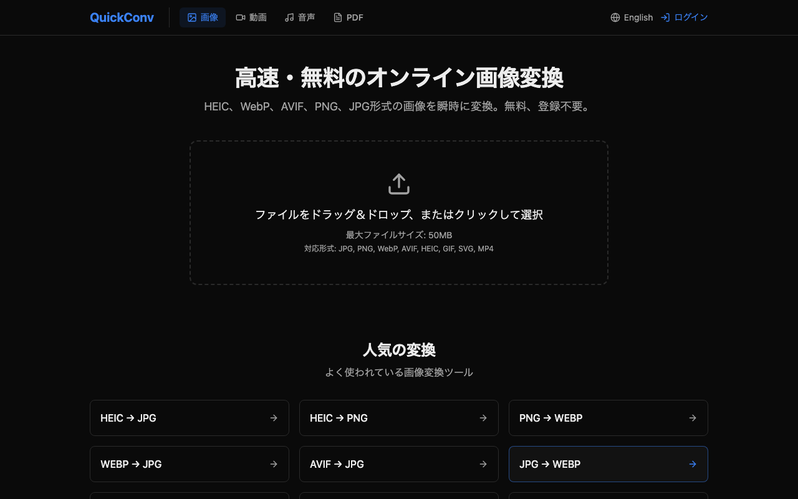
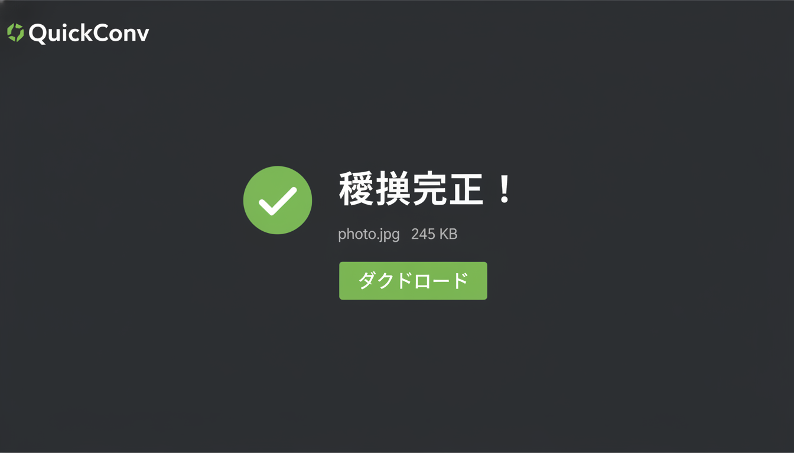

「録画した社内セミナーを通勤電車で聞き直したい」「Zoom 会議の録画から音声だけ取り出して文字起こしツールに渡したい」── 動画ファイルから音声だけを抽出したい場面は、リモートワークが普及した現在ますます増えています。

ところが、いざやろうとすると意外に面倒です。FFmpeg はコマンドラインの知識が要りますし、専用ソフトのインストールも気が進みません。

この記事では、ブラウザだけで完結する MP4→MP3 変換の手順を、画像・動画変換サービス [QuickConv](https://quickconv.cc) を運営している立場から解説します。

---

## 1. 動画から音声だけ抽出したい場面

実際にユーザーから多い、MP4→MP3 変換のニーズをまとめます。

| シーン | なぜ MP3 が欲しいのか |
|---|---|
| 講義・社内セミナーの録画を通勤中に聞き直したい | スマホの音楽アプリで再生したい、画面を見られない |
| 会議録画から議事録用の音声を取り出したい | Whisper 等の文字起こしツールに渡したい |
| ポッドキャスト素材を動画から分離したい | 配信プラットフォームが音声形式のみ対応 |
| インタビュー動画を音声教材化したい | データ容量を抑えて配布したい |
| 動画 BGM を音声素材として再利用したい | 別の動画編集や DTM で使い回したい |

特に伸びているのが **「会議録画 → 文字起こし」用途** です。Zoom や Google Meet で録画した動画は MP4 で保存されますが、文字起こしサービスは MP3/WAV など音声フォーマットしか受け付けないことが多く、変換が必須になります。

---

## 2. 従来の方法と問題点

これまで MP4→MP3 変換には、主に次の 3 つの方法がありました。

### 方法 A: FFmpeg をコマンドラインで使う

```bash
ffmpeg -i input.mp4 -vn -acodec libmp3lame -ab 192k output.mp3
```

確かに無料・高品質・確実ですが、

- そもそも FFmpeg のインストールが必要
- コマンドオプション (`-vn`, `-acodec libmp3lame`, `-ab 192k`) の意味を覚える必要がある
- 同僚に「このファイル MP3 にして送って」と渡せない

技術者にとっては最強ですが、「今すぐ 1 ファイルだけ変換したい」場面にはオーバースペックです。

### 方法 B: 専用ソフトをインストール

「Audacity」「VLC」「HandBrake」など定番ソフトはありますが、

- インストールにストレージを取られる
- 起動が重い
- たまに 1 回しか使わないのに常駐させたくない

特に会社支給 PC ではインストール権限が無いケースも多く、現実的ではありません。

### 方法 C: 既存のオンラインツール

検索すると無数に出てきますが、

- 広告が画面の半分以上を占める
- ファイルサイズ上限が小さい (10MB 等)
- アップロードしたファイルがいつまでサーバに残るか不明
- 出力フォーマットが少ない

「とりあえず変換できればいい」と割り切れば使えますが、業務用の動画 (1GB 超) はそもそも通らないことも。

---

## 3. QuickConv での MP4→MP3 変換手順

ここから、ブラウザだけで完結する手順を紹介します。会員登録もインストールも不要、3 ステップで完了します。



### Step 1: quickconv.cc にアクセス

ブラウザで [https://quickconv.cc](https://quickconv.cc) を開きます。トップページに大きな「ファイルをドロップ」エリアが表示されます。

### Step 2: MP4 ファイルをドラッグ＆ドロップ

変換したい `.mp4` ファイルをそのままページにドラッグして放します。クリックでファイル選択ダイアログを開いてもかまいません。

複数ファイルをまとめて投入することも可能です（Free プランは 1 回 3 ファイルまで、容量上限 10MB）。会議録画など大きなファイルを扱うなら有料プランへの切替を検討してください。

### Step 3: 出力フォーマットで MP3 を選択 → 変換



ファイルアップロード後、出力フォーマット選択肢が表示されます。`MP3` をクリック（またはタップ）。「変換」ボタンを押すと、サーバ側で動画から音声だけが抽出され、数十秒で完了します。

完了後、自動的にダウンロードリンクが表示されるのでクリックして保存。あとは普段使っている音楽プレイヤーや文字起こしサービスに渡すだけです。

---

### アップロードしたファイルはどうなる？

QuickConv では、**アップロードファイルと変換結果は 24 時間後に自動削除** されます。社内会議録画や講義録画など機密性の高い素材も、サーバに残し続ける設計はしていないので比較的安心です。

機密性が極めて高い場合は、念のため変換完了 → ダウンロード後に「削除」ボタンを押すと即時削除も可能です。

---

## 4. 対応フォーマット一覧

QuickConv は MP4→MP3 だけでなく、複数の動画・音声フォーマットに対応しています。

### 動画入力 (Video Input)

| 拡張子 | 形式 | 主な用途 |
|---|---|---|
| MP4 | H.264/H.265 | YouTube、Zoom 録画、スマホ動画 |
| WebM | VP8/VP9 | Web 用動画、Chrome 録画 |
| AVI | レガシー | 古いカメラ、Windows 標準 |
| MOV | QuickTime | iPhone、Mac 標準 |

### 音声出力 (Audio Output)

| 拡張子 | 形式 | おすすめ用途 |
|---|---|---|
| MP3 | 圧縮、互換性最強 | 音楽アプリ、文字起こし、配布 |
| WAV | 非圧縮、高品質 | 音声編集、DTM 素材 |
| AAC | 圧縮、高音質 | iOS/iTunes、ストリーミング |
| OGG | 圧縮、オープン | ゲーム、Web 音声 |
| FLAC | 可逆圧縮、無劣化 | アーカイブ、オーディオファン |

「とりあえず聞ければ良い」なら **MP3 (192kbps)** で十分。文字起こしや音声編集に使うなら **WAV** が無難です。

---

## 5. 実測ベンチマーク: どのくらいで変換できるのか

QuickConv の変換エンジン (Node.js 22 + ffmpeg 8.1, libmp3lame VBR `-q:a 2`) で実測した数値です。中央値は 5 回試行のうちのウォームアップ 1 回を除いた median。

| 入力 | 出力 | 入力サイズ | 変換時間（中央値） |
|---|---|---|---|
| MP4（30 秒、320x240、H.264+AAC） | MP3 (`libmp3lame -q:a 2`, ~190 kbps VBR) | 678 KB | 93ms |

30 秒の会議録画なら 1 秒以内、1 時間のセミナー録画でもおおむね数秒から十数秒で抽出が終わる計算です（実際には R2 アップロード / ダウンロードのネットワーク時間が支配的）。

> 計測方法は同リポジトリの `tools/seo-pipeline/benchmark.mjs` を参照。本番 API のレートリミットを避けるため、ローカルで同じ ffmpeg ビルドを直接叩いて median を取っています。ネットワーク・キューの待ち時間は含みません。

---

## 6. まとめ

- 動画から音声だけ抽出したいニーズは、講義・会議録画・ポッドキャスト素材など多岐に渡る
- FFmpeg / 専用ソフト / 広告だらけのオンラインツールには、それぞれ別の不便さがある
- QuickConv なら **ブラウザだけ・3 ステップ・無料** で MP4→MP3 変換が完了
- アップロードファイルは 24 時間で自動削除、即時削除も可能なのでプライバシー面も安心
- MP3 以外にも WAV / AAC / OGG / FLAC が選べるので、用途に応じた最適形式を選択可能

「会議録画から音声だけ取り出して文字起こしに回したい」「セミナーを通勤中に聞き直したい」── そんなときは、まず [quickconv.cc](https://quickconv.cc) で 3 ステップ変換するのが 2026 年現在の最短ルートです。

---

### 関連リンク

- [QuickConv トップ](https://quickconv.cc) — 動画・音声・画像の相互変換に対応
- 関連記事: [WebP を PNG に変換する最も簡単な方法](/articles/004-webp-to-png)
- 関連記事: [WebP vs AVIF vs HEIC 徹底比較](/articles/002-format-comparison)

---

## 7. 他の MP4 → MP3 変換サービスとの比較

代表的なオンライン MP4 → MP3 変換サービスを比較しました。

| サービス | 無料枠 | アカウント | 自動削除 | 広告 | 出力フォーマット |
|---|---|---|---|---|---|
| QuickConv | 1日 10 回 / 100MB | 不要 | 24 時間 | なし | MP3 / WAV / AAC / OGG / FLAC |
| Convertio | 1日 10 回 / 100MB | 不要（有料は要） | プランによる | 控えめ | MP3 / WAV / AAC / OGG / FLAC 等 |
| CloudConvert | 1日 25 分のコンバート時間 | 不要 | 24 時間 | なし | 多数 |
| OnlineVideoConverter | 無制限（広告多め） | 不要 | 不明 | 多め | MP3 / AAC 等 |
| 123APPS Audio Converter | 1日数回 | 不要 | 不明 | 控えめ | MP3 / WAV / FLAC 等 |

「広告を最小にしたい」「24 時間で確実に消えてほしい」用途なら **QuickConv** か **CloudConvert**、「とにかく素早く 1 回だけ」なら **OnlineVideoConverter** が選択肢になります。

---

## 著者・運営者プロフィール

QuickConv（[quickconv.cc](https://quickconv.cc)）は個人開発者が運営する画像・動画・音声変換サービスです。フロントエンド・API・変換エンジン・課金まで一人で実装しており、本記事の手順や比較表は本番運用の知見に基づいています。

- X: [@quickconv](https://twitter.com/quickconv)
- 運営: QuickConv（個人開発）
- 関連（英語）: [技術スタック全公開](./001-tech-stack.md)
